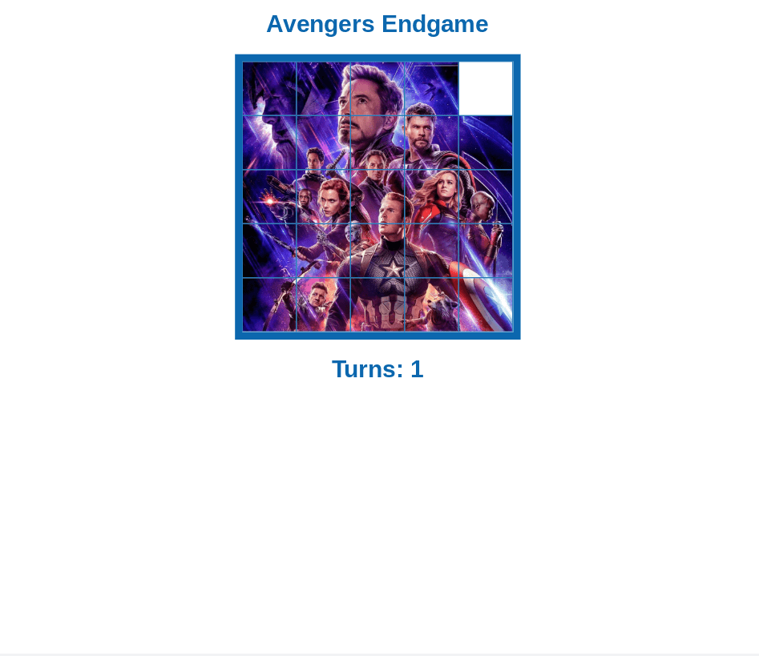

# Slide Puzzle Challenge

## Overview

[Kenny Yip Coding tutorial](https://youtu.be/sD3Os4H_EOU) coding challenge - convert completed result to an avengers 5 x 5 slide puzzle.

## Screenshots

## Link

- [Github Pages](https://jdegand.github.io/slide-puzzle-challenge)

## Thoughts

- made it better for mobile

- tough to confirm puzzle is correct - imgOrder cannot be compared to ids

- puzzle is correct but you can still continue to move puzzle pieces 

- if you could check for a win, you could lock the puzzle pieces by removing all event listeners

- making the puzzle 5 x 5 makes it difficult to set a imgOrder that doesn't require a ton of moves to complete - tougher to manually test

- objected oriented programming is better for games since you can store the references you need to faciliate comparisons

- need to look if you really need to declare all drag listeners or whether you can omit the ones you don't use - (in this game) dragLeave 

## Useful Resources 

- [Stack Overflow](https://stackoverflow.com/questions/7837456/how-to-compare-arrays-in-javascript) - compare arrays in js

- [Stack Overflow](https://stackoverflow.com/questions/7115022/how-do-i-enumerate-all-of-the-html-ids-in-a-document-with-javascript) - enumerate all of the html ids

## Acknowledgements

- [Kenny Yip](https://github.com/ImKennyYip)
